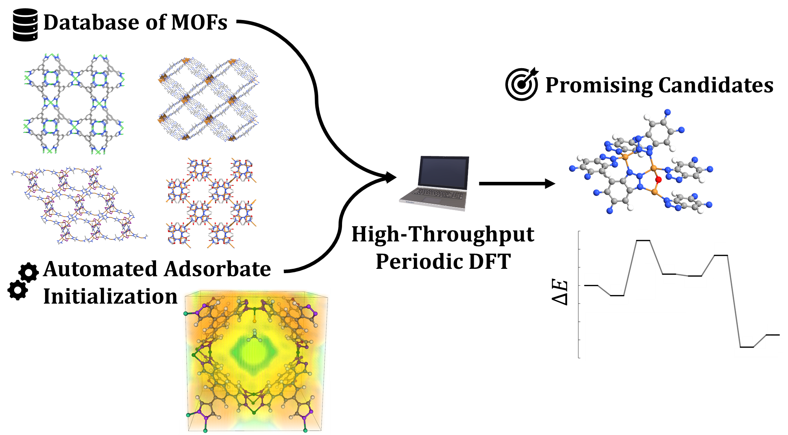

# PyMOFScreen
Python workflow for high-throughput DFT screening of MOFs using VASP. Relevant details for the code can be found in the following paper:

A.S. Rosen, J.M. Notestein, R.Q. Snurr. "Identifying Promising Metal-Organic Frameworks for Heterogeneous Catalysis via High-Throughput Periodic Density Functional Theory", J. Comput. Chem. (2019). DOI: [10.1002/jcc.25787](https://onlinelibrary.wiley.com/doi/10.1002/jcc.25787).

[](https://zenodo.org/badge/latestdoi/113722940)



## What is PyMOFScreen?

High-throughput DFT involving MOFs is a tricky business. Their large unit cells, diverse structures, and widely varying compositions make it challenging to achieve both a robust and high-performing workflow with little human interactions. PyMOFScreen solves this problem through multi-stage structural optimizations, a robust selection of optimization algorithms that are chosen on-the-fly, automatic error-handling, and more. In the Snurr group, we have used PyMOFScreen to screen thousands of MOFs using periodic DFT in a fully automated fashion. To automate the adsorbate construction process, refer to our [MOF Adsorbate Initializer](https://mai.readthedocs.io/en/latest/) (MAI) code.

## Ready-to-Run Examples

### Minimal Example
To get started, sample scripts are provided in the [`mof_screen/examples`](https://github.com/arosen93/mof_screen/tree/master/examples) directory. Below is a minimal example for performing a volume relaxation for a set of CIFs stored in the directory `mofpath`.

```python
from pymofscreen.cif_handler import get_cif_files
from pymofscreen.screen import screener

#Set up paths
mofpath = 'path/to/my/CIFs'
basepath = 'path/to/store/vasp_output'
submit_script = 'path/to/job_submission/script/submit.sh'

#Read in CIF files
cif_files = get_cif_files(mofpath)

#Construct screener object
s = screener(basepath,mofpath,submit_script=submit_script)

#Run volume relaxation for each CIF
for cif_file in cif_files:
	mof = s.run_screen(cif_file,'volume')
```

### Specifying VASP Parameters
Of course, in practice it is essential to specify parameters such as the exchange-correlation functional, convergence criteria, and so on. All of the VASP parameters for each job type are specified in [`pymofscreen.default_calculators.py`](https://github.com/arosen93/mof_screen/blob/master/pymofscreen/default_calculators.py), which we suggest looking at before running PyMOFScreen for the first time. The parameters can be freely changed using any of [ASE's parameters for VASP](https://wiki.fysik.dtu.dk/ase/ase/calculators/vasp.html). These parameters can be accessed and modified in a Python script like shown below.

```python
from pymofscreen.cif_handler import get_cif_files
from pymofscreen.screen import screener
from pymofscreen.default_calculators import defaults

#Set up paths
mofpath = 'path/to/my/CIFs'
basepath = 'path/to/store/vasp_output'
submit_script = 'path/to/job_submission/script/submit.sh'

#Define defaults
defaults['xc'] = 'BEEF-vdW'
defaults['ivdw'] = 0
defaults['ediffg'] = -0.02 #and so on...

#Read CIF files
cif_files = get_cif_files(mofpath)

#Construct screener object
s = screener(basepath,mofpath,submit_script=submit_script)

#Run volume relaxation for each CIF
for cif_file in cif_files:
	mof = s.run_screen(cif_file,'volume')
```

## Overview of Input Arguments

```python
class screener():
	"""
	This class constructs a high-throughput screening workflow
	"""
	def __init__(self,basepath,mofpath=None,kpts_path='Auto',kppas=None,
		submit_script=None,stdout_file=None):
```
The main tool to initialize a screening workflow is the [`pymofscreen.screen.screener`](https://github.com/arosen93/mof_screen/blob/master/pymofscreen/screen.py#L12) class, which takes the following arguments and keywords:
	
1. `basepath`: The base directory where the VASP output files will be stored. The converged results will be stored in `basepath/results`, and any errors will be stored in `basepath/errors`.
2. `mofpath`: The path where the starting CIFs are located. Defaults to `basepath/mofpath` if not specified.
3. `kpts_path` and `kppas`: If `kpts_path` is set to `Auto` (recommended), PyMOFScreen will automatically generate a k-point grid based on the `kppas` keyword argument. The `kppas` argument should be a list with two entries consisting of the low- and high-accuracy k-point density to use, in units of k-points per number of atoms (defaults to `kppas=[100,1000]`). If you want more fine-tuned control, you can instead provide a text file listing the desired k-point grids for each CIF, specifying the path to this file via `kpts_path` and leaving `kppas=None` (see [here](https://github.com/arosen93/mof_screen/blob/master/examples/example_kpts.txt) for an example k-points file).
4. `submit_script`: The path to the job submission script. An example job submission script can be found [here](https://github.com/arosen93/mof_screen/blob/master/examples/volume_relaxation/runner/sub_screen.job). If not specified, it defaults to `sub_screen.job`.
5. `stdout_file`: The name of the standard output file created by the job scheduler. This defaults to the basename of Python script with the extension `.out` if not otherwise specified.

```python
def run_screen(self,cif_file,mode,niggli=True,spin_levels=None,nupdowns=None,acc_levels=None,calculators=calcs):
	"""
	Run high-throughput ionic or volume relaxations
	"""
```
Within the `screener` class is a function named [`run_screen`](https://github.com/arosen93/mof_screen/blob/master/pymofscreen/screen.py#L58). It informs the `screener` what type of job should be run and on what CIF file. This function takes the following arguments and keywords:

1. `cif_file`: The name of the CIF file to study with VASP.
2. `mode`: The type of job to run, which can be either `'volume'` or `'ionic'` for a volume or ionic relaxaxtion, respectively.
3. `niggli`: By default, it is set to `niggli=True` and tells PyMOFScreen to make a Niggli-reduced cell of your input file before running. This can be disabled with `niggli=False`.
4. `spin_levels`: This argument is used to set the desired spin states. By default, it is set to `spin_levels=['high','low']`, which tells PyMOFScreen to run a high-spin job and then a a low-spin job. If you want greater control, a list of initial magnetic moments can be provided for each spin initialization you'd like run. For instance, `spin_levels=[[0.0,0.0,1.0],[0.0,0.0,5.0]]` would tell PyMOFScreen to run two different spin state calculations, where the first job has initialized magnetic moments of [0,0,1] and the second has [0,0,5].
5. `nupdowns`: This argument is used if the user wishes to force a given spin state. It defaults to `nupdowns=None`, which disables the keyword. If desired, `nupdowns` can be used in an analagous way to `spin_levels`, such that `nupdowns=[1,5]` would ensure that NUPDOWN flag is set to 1 and 5 for the two spin state calculations, respectively.
5. `acc_levels`: This is a list of strings representing each job type to perform and in what order. Generally, this does not need to be changed and defaults to `acc_levels=['scf_test','isif2_lowacc','isif3_lowacc','isif3_highacc','final_spe]` for volume relaxations and `acc_levels=['scf_test','isif2_lowacc','isif2_medacc','isif2_highacc','final_spe']` for ionic relaxations.
6. `calculators`: This is function containing the [ASE calculators](https://wiki.fysik.dtu.dk/ase/ase/calculators/calculators.html) that are used to define the VASP parameters for each entry in `acc_levels`. By default, it will automatically pull the calculators from [`pymofscreen.default_calculators.calcs`](https://github.com/arosen93/mof_screen/blob/master/pymofscreen/default_calculators.py#L28). This variable does not typically need to be modified.

## Setup

### Installing PyMOFScreen

1. PyMOFScreen requires [Python](https://www.python.org/) 3.6 or newer. If you do not already have Python installed, the easiest option is to download the [Anaconda](https://www.anaconda.com/download/) distribution.
2. Download or clone the PyMOFScreen repository and run `pip install -r requirements.txt` followed by `pip install .` from the PyMOFScreen base directory. This will install PyMOFScreen and the required dependencies.
3. Since PyMOFscreen is built on [ASE](https://wiki.fysik.dtu.dk/ase/), you must make sure that your `VASP_PP_PATH` is set appropriately, as described [here](https://wiki.fysik.dtu.dk/ase/ase/calculators/vasp.html).
4. PyMOFScreen requires that VASP be installed on your compute cluster. The VASP build must be compiled with [VTSTools](http://theory.cm.utexas.edu/vtsttools/index.html) and must include both gamma-point only and standard builds.

### Python Dependencies

PyMOFScreen will automatically install all the dependencies for you with the `pip install -r requirements.txt` command, but if you wish to do this manually or encounter issues, the required dependencies are as follows:
1. A slightly modified build of [ASE](https://wiki.fysik.dtu.dk/ase/) 3.16.2 or newer. The required modification adds support for checking if a VASP job has failed due to SCF convergence issues (via `atoms.calc.scf_converged`) and if it has reached the maximum number of geometry optimization steps (via `atoms.calc.nsw_converged`). The customized ASE build, denoted rASE, can be found [at this link](https://github.com/arosen93/rASE). Alternatively, if you already have ASE installed, you can directly patch your `vasp.py` located in `ase/ase/calculators/vasp/vasp.py` by using the modified `vasp.py` script found [here](https://github.com/arosen93/rASE/blob/master/ase/calculators/vasp/vasp.py). 
2. [Pymatgen](http://pymatgen.org/) 2018.5.22 or newer. This is required for making primitive unit cells and generating automatic k-point grids but is optional if neither feature is desired.

### Compute Environments

Every compute environment is unique, with different ways to run VASP and different job submission systems. To address this, the [`pymofscreen/compute_environ.py`](https://github.com/arosen93/mof_screen/blob/master/pymofscreen/compute_environ.py) file must be modified before installing PyMOFScreen.
1. Select or make your job submission system template in [`pymofscreen/compute_environ.py`](https://github.com/arosen93/mof_screen/blob/master/pymofscreen/compute_environ.py) to ensure that the variable [`nprocs`](https://github.com/arosen93/mof_screen/blob/master/pymofscreen/compute_environ.py#L42) refers to the total number of requested processors.
2. Specify the commands to launch the gamma-point and standard VASP executables in the [`choose_vasp_version` function](https://github.com/arosen93/mof_screen/blob/master/pymofscreen/compute_environ.py#L44). This tells PyMOFScreen how to construct ASE's required `run_vasp.py` file, as described [here](https://wiki.fysik.dtu.dk/ase/ase/calculators/vasp.html).